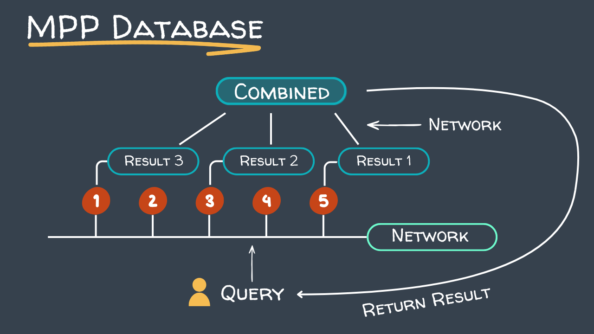
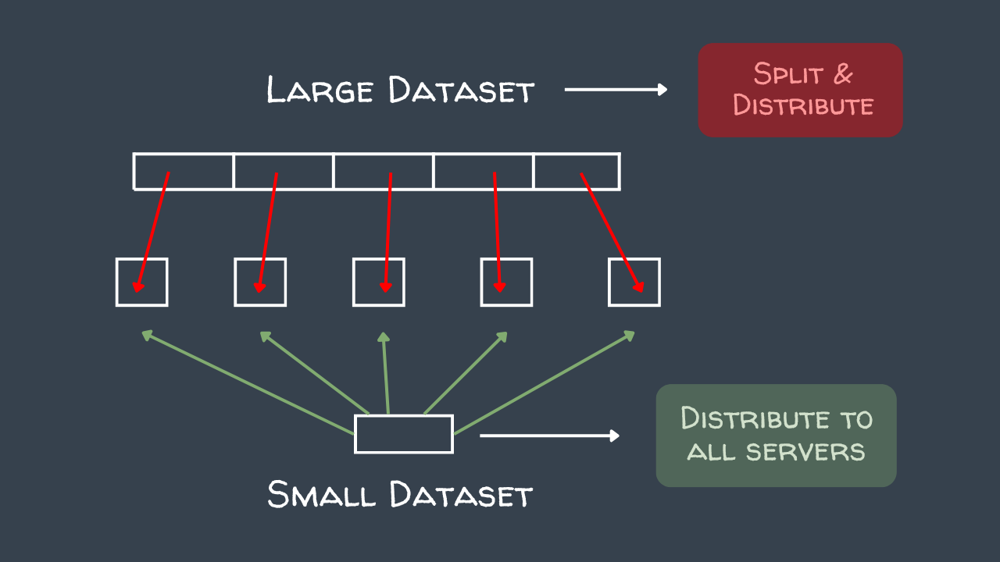
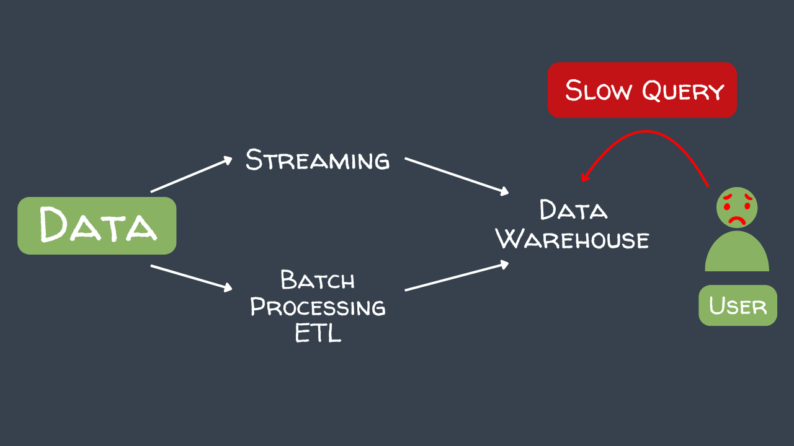
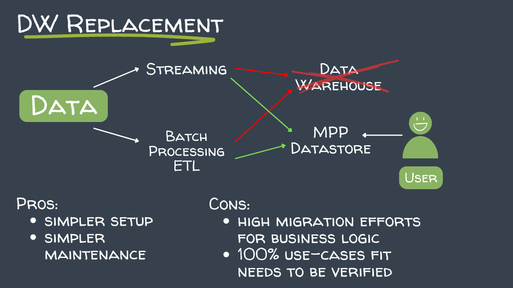
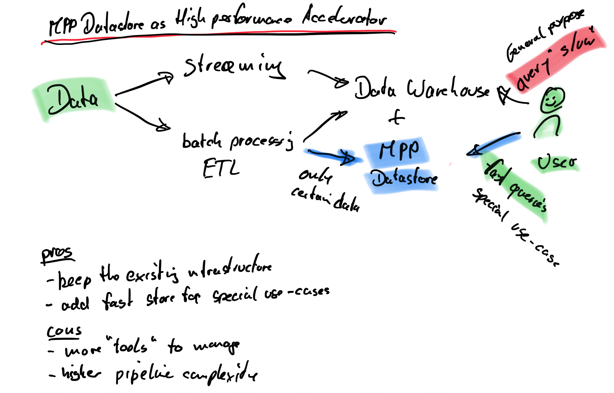

# MPP Data Store Basics

## Horizontal Scaling & Quick Queries

Massively Parallel Processing (MPP) databases scale horizontally by adding more nodes to the cluster. Each node handles a portion of the data and query workload in parallel, resulting in faster query execution as the cluster grows.

## Dataset Distribution

Data is distributed across nodes using a distribution key. Choosing the right key ensures rows are spread evenly, allowing all nodes to contribute equally to query processing.

---

# The Problem Exasol Solves and Use Cases

## The Typical Problem

Traditional data warehouses struggle with:

- **Slow queries** — analytical queries over large datasets take too long as data volumes grow
- **Low import speeds** — ingesting large amounts of data is a bottleneck, slowing down pipelines and reporting freshness
- **High costs** — managed cloud data warehouse platforms charge based on compute and storage usage, which quickly becomes expensive at scale. Hosting the infrastructure yourself gives you complete control over costs

## Exasol as the Data Warehouse Replacement

Exasol can replace a traditional data warehouse entirely, providing faster query performance at a fraction of the cost by running on your own EC2 infrastructure.

## Exasol as an Accelerator

Exasol can also be used alongside an existing data warehouse as a query acceleration layer — offloading the most demanding analytical queries to a high-performance Exasol cluster.

