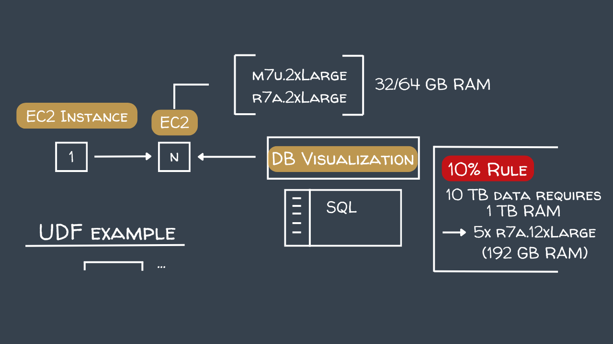
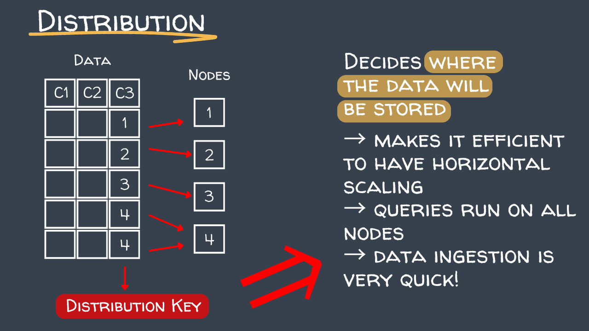
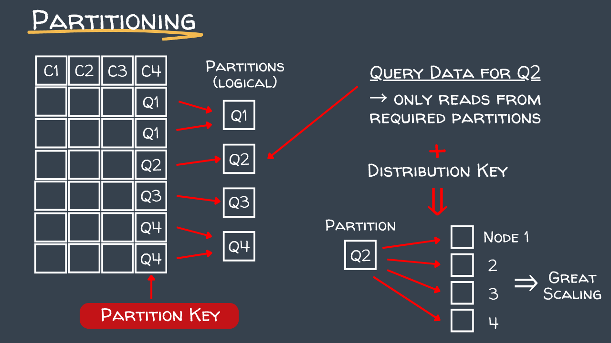

# How Exasol Achieves Performance

## Hardware Setup

Exasol Personal runs on AWS EC2 instances. The hardware setup determines cluster capacity and performance.

**The 10% Rule:** If you want to store 10 TB of data, you need 1 TB of RAM across the cluster. Exasol keeps data in compressed columnar format in memory for fast access.



---

## Distribution Key

The distribution key controls how rows are spread across nodes in the cluster. Choosing the right key is critical for performance:

- **Choose a column with high cardinality** (many unique values) so rows spread evenly across all nodes
- **Avoid low-cardinality columns** (e.g. boolean flags, status fields) as this causes data skew — most rows end up on one node while others sit idle
- **Use a column that appears frequently in JOIN conditions** — when two tables are distributed by the same key, joins can be executed locally on each node without shuffling data across the network



---

## Partition Key

The partition key creates logical partitions within each node, reducing the amount of data scanned when running queries with filter conditions.

- **Use a column that is frequently used in WHERE clauses** (e.g. a date or timestamp column)
- Exasol will skip entire partitions that don't match the filter, dramatically reducing I/O
- **Partition keys work best on time-based or categorical columns** with a manageable number of distinct values
- A partition key is independent from the distribution key — you can (and often should) set both



---

## No Need for Manual Indexes

Unlike traditional relational databases, **you do not need to create indexes in Exasol**. Exasol automatically creates and manages indexes internally based on the queries being executed. The database engine analyses query patterns and builds the appropriate data structures on its own.

If you do manually create an index, be aware: **Exasol will automatically drop any index that has not been used for 35 days**. Unused indexes consume memory and cluster resources, so Exasol removes them to keep the system lean and efficient.

The practical takeaway is to focus your tuning efforts on choosing the right distribution and partition keys — these have far more impact on performance than manually managing indexes.

---

## Fast Joins — Table Replication

When joining two tables, Exasol needs both sides of the join to be on the same node. For large tables, this is achieved by distributing both on the same key. For small tables, Exasol takes a smarter approach: **it automatically replicates the entire small table across all nodes**, so every node has a local copy and no data needs to travel across the network.

The default threshold for this behaviour is **100,000 rows**. Any table below this size will be fully replicated across all nodes during a join rather than distributed row by row. This threshold can be adjusted with:

```sql
ALTER SYSTEM SET REPLICATION_BORDER = <number_of_rows>;
```

In practice this means small lookup tables (e.g. dimension tables, reference data) will always join efficiently without any extra configuration.

---

