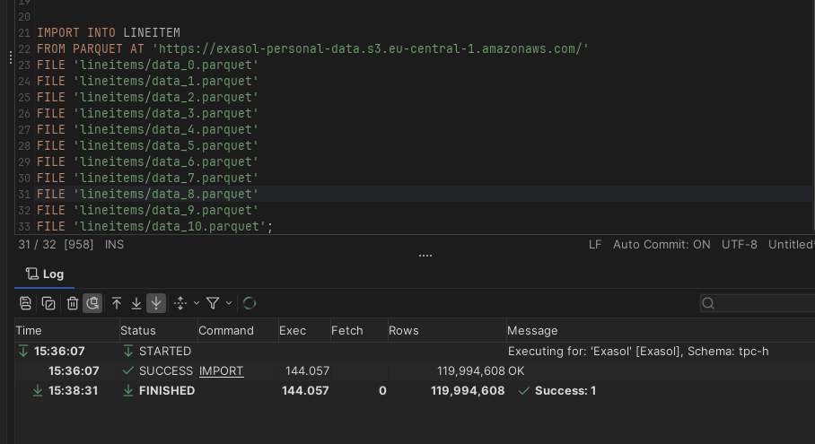
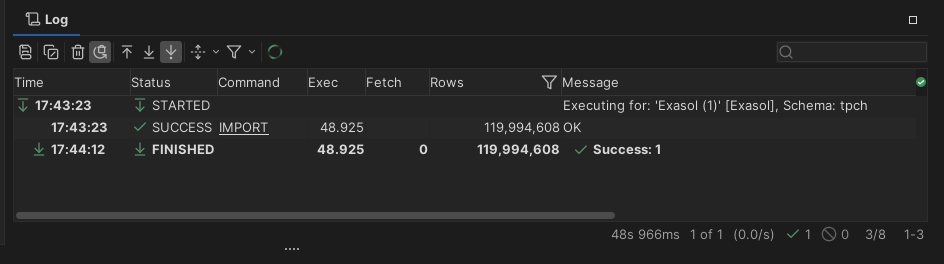

# Query Optimization

## Setting Up the TPC-H Dataset

To explore query optimization we will use the industry-standard TPC-H benchmark dataset at 100 GB scale. Rather than downloading a pre-built dataset (which would be slow and inefficient), we generate it ourselves from the TPC-H source code.

### Step 1: Download the TPC-H Source Code

1. Go to the [TPC-H Specification page](https://www.tpc.org/tpc_documents_current_versions/current_specifications5.asp)
2. Fill in the required information to request the download
3. You will receive an email with a download link

> **Note:** The download link is only valid for a short period (less than 24 hours). Make sure to download the source code as soon as you receive the email.

### Step 2: Generate the Dataset

Once you have the source code, we will use it to generate the 100 GB dataset locally and load it into Exasol.

## Adding a Quarter Column

To add a `quarter` column with random values between 1 and 4:

```sql
ALTER TABLE your_table ADD COLUMN quarter INT;

UPDATE your_table
SET quarter = FLOOR(RAND() * 4) + 1;
```

- log  into the AWS instance using the UI (go to instances and do connect)

- sudo apt update
- sudo apt install build-essential -y
- cd tpch-kit/dbgen
- ./dbgen -s 10
- ls -lh *.tbl
- df -h
- sudo apt install python3 python3-pip python3-venv -y
- python3 -m venv tpch-env
- source tpch-env/bin/activate
- pip install duckdb pandas pyarrow
- nano convert_to_parquet.py

import duckdb
import os

con = duckdb.connect()

tables = [
    "region",
    "nation",
    "part",
    "supplier",
    "partsupp",
    "customer",
    "orders",
    "lineitem"
]

for table in tables:
    print(f"Processing {table}...")

    con.execute(f"DROP TABLE IF EXISTS {table};")

    con.execute(f"""
        CREATE TABLE {table} AS
        SELECT *
        FROM read_csv_auto(
            '{table}.tbl',
            delim='|',
            header=False,
            ignore_errors=True,
            null_padding=True
        );
    """)

    row_count = con.execute(f"SELECT COUNT(*) FROM {table};").fetchone()[0]
    print(f"Rows loaded: {row_count}")

    os.makedirs(f"parquet/{table}", exist_ok=True)

    if table == "lineitem":
        con.execute(f"""
            COPY (
                SELECT
                    *,
                    1 + (abs(hash(column00, column03)) % 4) AS quarter_rand,
                    CASE
                        WHEN abs(hash(column00, column03, column01)) % 100 < 95 THEN 1
                        ELSE 2
                    END AS hotspot_key
                FROM {table}
            )
            TO 'parquet/{table}'
            (
                FORMAT PARQUET,
                PER_THREAD_OUTPUT TRUE,
                FILE_SIZE_BYTES '512MB',
                ROW_GROUP_SIZE 1000000
            );
        """)
    else:
        con.execute(f"""
            COPY {table}
            TO 'parquet/{table}'
            (
                FORMAT PARQUET,
                PER_THREAD_OUTPUT TRUE,
                FILE_SIZE_BYTES '512MB',
                ROW_GROUP_SIZE 1000000
            );
        """)

    con.execute(f"DROP TABLE {table};")

print("Done.")


- python3 convert_to_parquet.py


- aws s3 cp parquet/lineitem \
  s3://exasol-personal-data/lineitems/ \
  --recursive

- sudo apt install awscli -y

- aws configure (use keys for your user)

- aws s3 cp parquet/lineitem \
  s3://your-bucket/lineitems/ \
  --recursive

- cleanup rm -rf parquet 
rm -f *.tbl

## stop your cluster and create a new one with 4 nodes

- exasol stop
- cd ..
- md 4-node-cluster
- exasol install aws --cluster-size 4

- log back in with dbvisualizer using the information shown

## Create the bad table and query it

- in exasol create table: 

CREATE OR REPLACE TABLE LINEITEM_BAD_DIST (
    L_ORDERKEY      DECIMAL(18,0),
    L_PARTKEY       DECIMAL(18,0),
    L_SUPPKEY       DECIMAL(18,0),
    L_LINENUMBER    DECIMAL(18,0),
    L_QUANTITY      DOUBLE PRECISION,
    L_EXTENDEDPRICE DOUBLE PRECISION,
    L_DISCOUNT      DOUBLE PRECISION,
    L_TAX           DOUBLE PRECISION,
    L_RETURNFLAG    VARCHAR(1),
    L_LINESTATUS    VARCHAR(1),
    L_SHIPDATE      DATE,
    L_COMMITDATE    DATE,
    L_RECEIPTDATE   DATE,
    L_SHIPINSTRUCT  VARCHAR(25),
    L_SHIPMODE      VARCHAR(10),
    L_COMMENT       VARCHAR(44),
    QUARTER_RAND    DECIMAL(1,0),
    HOTSPOT_KEY     DECIMAL(1,0)
);

- set the distribution key
ALTER TABLE LINEITEM_BAD_DIST DISTRIBUTE BY HOTSPOT_KEY;


- do the import

IMPORT INTO LINEITEM_BAD_DIST
FROM PARQUET AT 'https://exasol-personal-data.s3.eu-central-1.amazonaws.com/'
FILE 'lineitems/data_0.parquet'
FILE 'lineitems/data_1.parquet'
FILE 'lineitems/data_2.parquet'
FILE 'lineitems/data_3.parquet'
FILE 'lineitems/data_4.parquet'
FILE 'lineitems/data_5.parquet'
FILE 'lineitems/data_6.parquet'
FILE 'lineitems/data_7.parquet'
FILE 'lineitems/data_8.parquet'
FILE 'lineitems/data_9.parquet';

- show the distribution on the nodes

SELECT
    IPROC() AS NODE_ID,
    COUNT(*) AS ROWS_ON_NODE
FROM LINEITEM_BAD_DIST
GROUP BY IPROC()
ORDER BY IPROC();


- Do a count

SELECT COUNT(*)
FROM LINEITEM_BAD_DIST
WHERE HOTSPOT_KEY = 1;

- Do a heavy query

SELECT
    L_PARTKEY,
    L_SUPPKEY,
    SUM(L_EXTENDEDPRICE) AS revenue,
    SUM(L_QUANTITY) AS qty,
    AVG(L_DISCOUNT) AS avg_discount
FROM LINEITEM_BAD_DIST
WHERE HOTSPOT_KEY = 1
GROUP BY
    L_PARTKEY,
    L_SUPPKEY
LIMIT 100;


## upload the good dataset

- create table

CREATE OR REPLACE TABLE LINEITEM_GOOD_DIST (
    L_ORDERKEY      DECIMAL(18,0),
    L_PARTKEY       DECIMAL(18,0),
    L_SUPPKEY       DECIMAL(18,0),
    L_LINENUMBER    DECIMAL(18,0),
    L_QUANTITY      DOUBLE PRECISION,
    L_EXTENDEDPRICE DOUBLE PRECISION,
    L_DISCOUNT      DOUBLE PRECISION,
    L_TAX           DOUBLE PRECISION,
    L_RETURNFLAG    VARCHAR(1),
    L_LINESTATUS    VARCHAR(1),
    L_SHIPDATE      DATE,
    L_COMMITDATE    DATE,
    L_RECEIPTDATE   DATE,
    L_SHIPINSTRUCT  VARCHAR(25),
    L_SHIPMODE      VARCHAR(10),
    L_COMMENT       VARCHAR(44),
    QUARTER_RAND    DECIMAL(1,0),
    HOTSPOT_KEY     DECIMAL(1,0)
);

- set distribution key

ALTER TABLE LINEITEM_GOOD_DIST DISTRIBUTE BY L_ORDERKEY;


- import data

IMPORT INTO LINEITEM_GOOD_DIST
FROM PARQUET AT 'https://exasol-personal-data.s3.eu-central-1.amazonaws.com/'
FILE 'lineitems/data_0.parquet'
FILE 'lineitems/data_1.parquet'
FILE 'lineitems/data_2.parquet'
FILE 'lineitems/data_3.parquet'
FILE 'lineitems/data_4.parquet'
FILE 'lineitems/data_5.parquet'
FILE 'lineitems/data_6.parquet'
FILE 'lineitems/data_7.parquet'
FILE 'lineitems/data_8.parquet'
FILE 'lineitems/data_9.parquet';

- compare the distribution

SELECT
    IPROC() AS NODE_ID,
    COUNT(*) AS ROWS_ON_NODE
FROM LINEITEM_GOOD_DIST
GROUP BY IPROC()
ORDER BY IPROC();

- run our heavy query again and compare

SELECT
    L_PARTKEY,
    L_SUPPKEY,
    L_SHIPMODE,
    L_RETURNFLAG,
    SUM(L_EXTENDEDPRICE) AS REVENUE,
    SUM(L_QUANTITY) AS QTY,
    AVG(L_DISCOUNT) AS AVG_DISCOUNT,
    AVG(L_TAX) AS AVG_TAX
FROM LINEITEM_GOOD_DIST
WHERE QUARTER_RAND = 1
GROUP BY
    L_PARTKEY,
    L_SUPPKEY,
    L_SHIPMODE,
    L_RETURNFLAG
LIMIT 100;

## Cluster Scaling — Import Performance Comparison

Using the 120 million row lineitem dataset, we can clearly see the performance benefit of adding more nodes to the cluster.

**Single-node cluster:**



**4-node cluster:**



The results show a significant reduction in import time when scaling from 1 to 4 nodes. Exasol distributes the workload across all nodes in parallel, so adding nodes directly translates into faster data ingestion.


