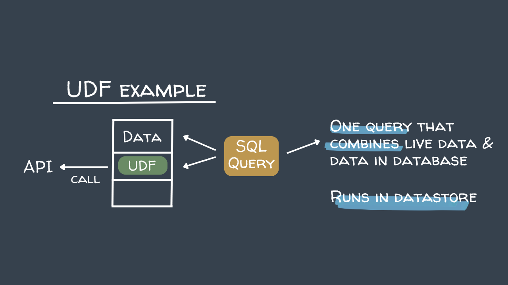
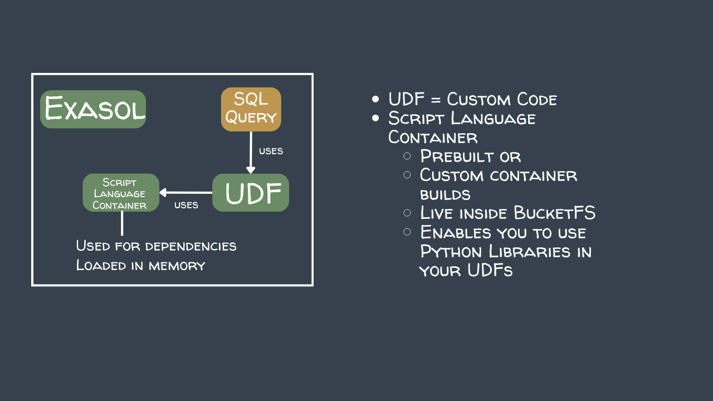

# Using a UDF in Exasol

This lesson demonstrates how to create and use a Python UDF (User Defined Function) in Exasol. The UDF takes a stock symbol as input and queries the Financial Modeling Prep API to return company information.





## Step 1: Create the Companies Table

Create a table to store the stock symbols you want to look up:

```sql
CREATE TABLE "COMPANIES" (
    "ID"     INTEGER NOT NULL,
    "SYMBOL" VARCHAR(10),
    PRIMARY KEY ("ID")
);
```

Insert the stock symbols:

```sql
INSERT INTO COMPANIES VALUES (1, 'TSLA');
INSERT INTO COMPANIES VALUES (2, 'AAPL');
INSERT INTO COMPANIES VALUES (3, 'LMT');
```

## Step 2: Create the UDF

The following Python3 UDF takes a stock symbol, calls the Financial Modeling Prep API, and emits one row per matching result with the symbol name, currency, and exchange information.

First create a connection to keep the url and password that you use in the UDF secret
```sql
CREATE CONNECTION FMP_KEY TO 'https://financialmodelingprep.com/stable/search-symbol' IDENTIFIED BY '<your-api-key>';
```

> **Note:** Replace the `apikey` value with your own API key from [financialmodelingprep.com](https://financialmodelingprep.com).

Then create the UDF

```sql
CREATE OR REPLACE PYTHON3 SCALAR SCRIPT "LINEITEMS"."GET_STOCK_INFO"(SYMBOL VARCHAR(32))
EMITS (
    SYMBOL           VARCHAR(32),
    NAME             VARCHAR(64),
    CURRENCY         VARCHAR(5),
    EXCHANGEFULLNAME VARCHAR(64),
    EXCHANGE         VARCHAR(32)
) AS
import requests

def run(ctx):
    url = exa.get_connection("FMP_KEY").address
    params = {
        "query": ctx.SYMBOL,
        "apikey": exa.get_connection("FMP_KEY").password
    }

    response = requests.get(url, params=params)

    if response.status_code == 200:
        data = response.json()

        for item in data:
            symbol           = item.get("symbol")
            currency         = item.get("currency")
            name             = item.get("name")
            exchangeFullName = item.get("exchangeFullName")
            exchange         = item.get("exchange")

            ctx.emit(symbol, name, currency, exchangeFullName, exchange)
/
```

The UDF runs with the standard Exasol Script Language Container — no custom container needed.

## Step 3: Execute the UDF

Run the UDF against all symbols in the companies table:

```sql
SELECT GET_STOCK_INFO(C.SYMBOL)
FROM COMPANIES C;
```

## Example Output

| SYMBOL | NAME | CURRENCY | EXCHANGEFULLNAME | EXCHANGE |
|---|---|---|---|---|
| TSLA | Tesla, Inc. | USD | NASDAQ Global Select | NASDAQ |
| TSLA.MX | Tesla, Inc. | MXN | Mexican Stock Exchange | MEX |
| AAPL | Apple Inc. | USD | NASDAQ Global Select | NASDAQ |
| AAPL.DE | Apple Inc. | EUR | Deutsche Börse | XETRA |
| LMT | Lockheed Martin Corporation | USD | New York Stock Exchange | NYSE |
| LMT.DE | Lockheed Martin Corporation | EUR | Deutsche Börse | XETRA |


## Step 4: Store the Results in a Table

Create a table to persist the UDF results:

```sql
CREATE TABLE "STOCK_DETAILS" (
    SYMBOL           VARCHAR(32),
    NAME             VARCHAR(64),
    CURRENCY         VARCHAR(5),
    EXCHANGEFULLNAME VARCHAR(64),
    EXCHANGE         VARCHAR(32)
);
```

Insert the UDF results directly into the table:

```sql
INSERT INTO STOCK_DETAILS
SELECT GET_STOCK_INFO(C.SYMBOL)
FROM COMPANIES C;
```

## Step 5: Query the Results

Query the stored stock details:

```sql
SELECT *
FROM STOCK_DETAILS
ORDER BY SYMBOL;
```

---


