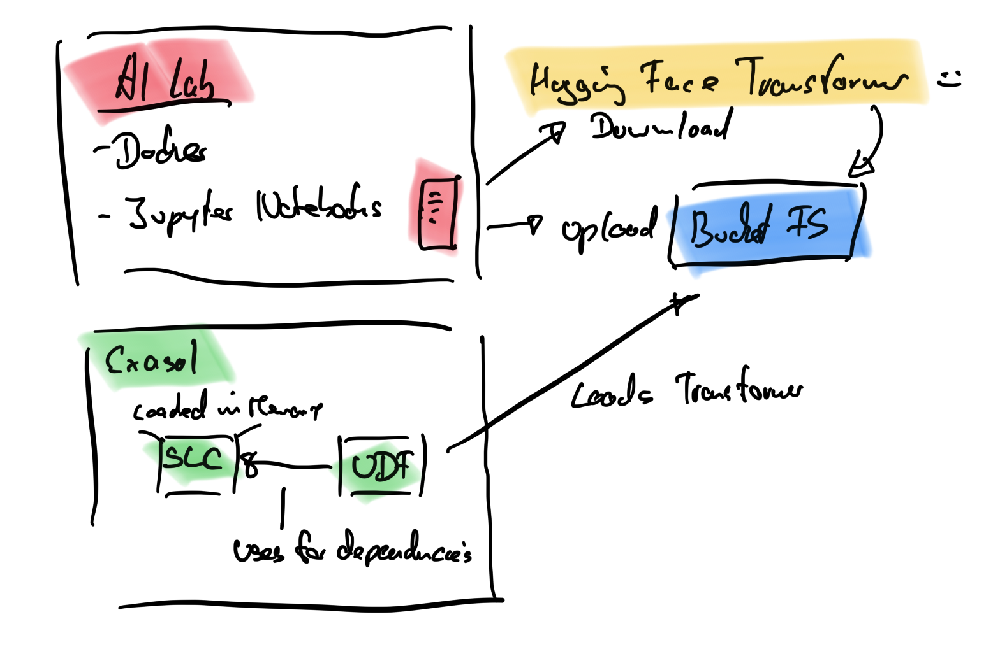
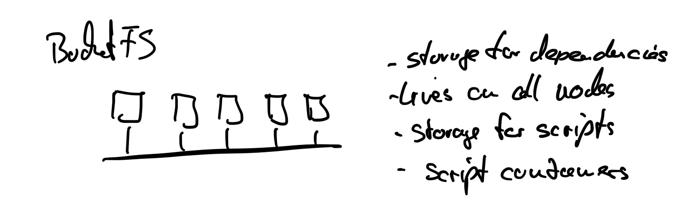

# start AI Lab. 

AI-LAB Docker: https://github.com/exasol/ai-lab

```bash
docker run --publish 0.0.0.0:49494:49494 exasol/ai-lab:4.0.0
```

Username is `ailab`

## BucketFS

This is the first time in this course we use BucketFS. The AI Lab uses BucketFS to store model files and other assets directly on the Exasol cluster, making them accessible to UDFs and scripts running inside the database.



For the AIlab configuration we need to configure bucketfs passwords for read and write.

Connect to the AWS instance and check available nodes:

```bash
ubuntu@ip-172-30-1-11:~$ ls -l
total 192208
-rwxr-xr-x 1 ubuntu ubuntu 196808888 Apr 10 08:43 c4
-rw-r--r-- 1 ubuntu ubuntu       568 Apr 10 08:43 config

ubuntu@ip-172-30-1-11:~$ c4 ps
     N  PLAY_ID   NODE  MEDIUM  INSTANCE  DB_VERSION  EXTERNAL_IP  INTERNAL_IP  STAGE  STATE  UPTIME    TTL  
     1  0a613755  11    host    -         2025.2.0    172.30.1.11  172.30.1.11  d      -      00:11:40  +∞   
     2  0a613755  11    local   -         2025.2.0    -            172.30.1.11  d      -      00:11:40  +∞   
```

Connect to the database node:

```bash
ubuntu@ip-172-30-1-11:~$ c4 connect -t 1.11/cos
Welcome to Ubuntu 22.04.5 LTS (GNU/Linux 6.8.0-1051-aws x86_64)
```

Retrieve the current BucketFS configuration:

```bash
root@n11:~# confd_client bucketfs_info bucketfs_name: bfsdefault
_sec_name: 'BucketFS : bfsdefault'
buckets:
  default:
    _sec_name: 'Bucket : default'
    additional_files:
    - EXASolution-2025:/opt/exasol/db-2025.2.0/bin/udf/*
    name: default
    public: true
    read_passwd: U0hreVUxaHhZWGczTTNCRVpsaGpibFpYYWpoU05HUmxjME5KYUhsMmIwTT0=
    write_passwd: TTFwTmRITnZNRTVFVTJSc1V6aFZSbGt3Ums5TFVscFVWemRTVkVNME0zUT0=
bucketvolume: None
http_port: 0
https_port: 2581
mode: rsync
name: bfsdefault
owner:
- 500
- 500
sync_key: MjZQN1YzbzRBWmcxTGNTNElkYlZhejM0SWs3RUJRRGI=
sync_period: '30000'
```

Set simple read/write passwords for the AI Lab:

```bash
root@n11:~# confd_client bucket_modify bucketfs_name: bfsdefault bucket_name: default public: true read_password: exasol write_password: exasol
OK
```

## Initialize Transformers Session / System

Activate the SLC for the current session only:

```sql
ALTER SESSION SET SCRIPT_LANGUAGES='R=builtin_r JAVA=builtin_java PYTHON3=builtin_python3 PYTHON3_TE=localzmq+protobuf:///bfsdefault/default/ai-lab/slc/exasol_transformers_extension_container_release?lang=python#/buckets/bfsdefault/default/ai-lab/slc/exasol_transformers_extension_container_release/exaudf/exaudfclient_py3';
```

To activate the SLC permanently on the system:

```sql
ALTER SYSTEM SET SCRIPT_LANGUAGES='R=builtin_r JAVA=builtin_java PYTHON3=builtin_python3 PYTHON3_TE=localzmq+protobuf:///bfsdefault/default/ai-lab/slc/exasol_transformers_extension_container_release?lang=python#/buckets/bfsdefault/default/ai-lab/slc/exasol_transformers_extension_container_release/exaudf/exaudfclient_py3';
```
