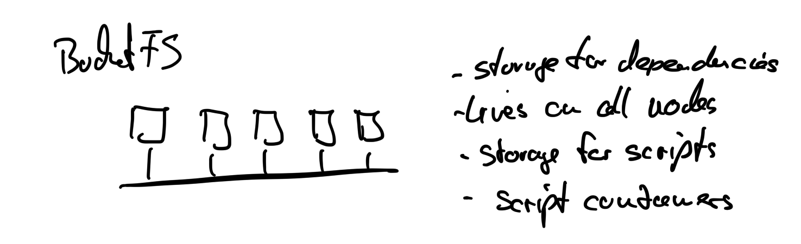

## BucketFS

This is the first time in this course we use BucketFS. The AI Lab uses BucketFS to store model files and other assets directly on the Exasol cluster, making them accessible to UDFs and scripts running inside the database.

AI-LAB Docker: https://github.com/exasol/ai-lab

docker run --publish 0.0.0.0:49494:49494 exasol/ai-lab
